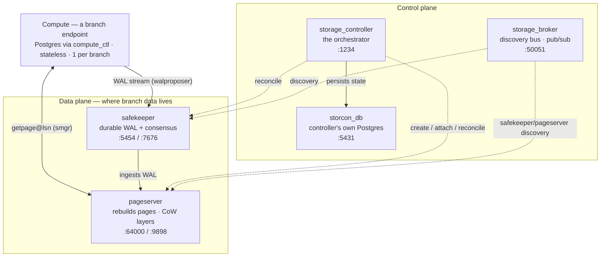

# DevDB Engine Architecture — the Neon storage engine

This is the substrate every DevDB branch sits on: the five long-running **Neon storage-engine
services** that the daemon supervises, plus the per-branch **computes** that come and go on top of
them. If you've ever looked at `GET /api/status` and wondered what `storcon_db`, `storage_broker`,
`storage_controller`, `safekeeper`, and `pageserver` actually *are*, this is the map.

> Scope: the engine binaries and how DevDB drives them. For the daemon's own structure (services,
> queue lanes, HTTP), see [AGENTS.md](../AGENTS.md) "Architecture in one paragraph"; for roadmap and
> tribal knowledge, [docs/phases-2-5-handover.md](phases-2-5-handover.md).

## The one idea: separated storage and compute

A normal Postgres is a single process that owns its files on local disk. Neon splits that in two:

- **Compute** — a stateless Postgres process that serves SQL but keeps *no durable local state*.
- **Storage** — a set of always-on services that hold the actual data (as write-ahead log + a
  layered page store) and can reconstruct any page at any point in history on demand.

Three product properties fall directly out of that split, and they are exactly why DevDB exists:

| Property | Why the split gives it |
|---|---|
| **Instant copy-on-write branching** | a branch is a new *timeline* that shares its parent's existing layers and only writes where it diverges — copying no data, regardless of DB size |
| **Time travel** | history is retained as immutable layers, so the store can serve state as of an older LSN |
| **Scale-to-zero** | kill the compute and the data is untouched in storage; start a fresh compute to resume |

`worktree : files :: branch : data` — the tagline — is literally implemented by these services.

## Topology

*Write path* (accent): compute → safekeeper → pageserver. *Read path*: compute ⇄ pageserver.
Everything else is control/discovery.

---

## The data plane — where your branch bytes live

### pageserver — the heart

The pageserver ingests the WAL stream and stores it as immutable **layer files** (base *image
layers* + *delta layers*), and from those it can **reconstruct any page at any LSN on demand**
(`getpage@lsn`). Two consequences make it the centre of gravity:

- **Copy-on-write branching.** A branch is a new *timeline* pointing at the parent's existing
  layers; it writes new layers only where it diverges. Creating one copies no data → instant,
  size-independent.
- **Time travel.** Because layers are immutable history, it can answer "the page as of LSN X".

When a compute needs data it does **not** read a local disk — its storage manager (the
`[NEON_SMGR] libpagestore: connected to …:64000` line in the logs) asks the pageserver for pages.
Your branch data physically lives in the pageserver's layer store on the volume.

- **Ports:** `64000` (libpq page service, what computes connect to) · `9898` (HTTP mgmt API, what
  the daemon's `PageserverClient` calls: `timeline_create` / `timeline_info` / `timeline_delete` /
  `timeline_detach_ancestor` / `tenant_delete`).
- **DevDB specifics:** configured by `pageserverToml()` in
  [engine/configs.ts](../packages/daemon/src/engine/configs.ts) — `remote_storage.local_path` →
  `/data/pageserver_1` (the layers), `pg_distrib_dir` → the composed `/data/pg_distrib` symlink dir
  (per-major Postgres binaries for WAL redo), disk-usage-based eviction enabled. Oracle:
  `src/daemon/pageserver/mod.rs`.

### safekeeper — durability + consensus for writes

A running compute does **not** fsync to local disk. Its **walproposer** (the `[WP]` log lines)
streams WAL to the safekeeper, which persists it and acknowledges through a Paxos-style quorum. The
pageserver then pulls that *committed* WAL to build its layers. So durability and page-materialisation
are separated: the safekeeper guarantees the write is safe; the pageserver makes it queryable.

Real Neon runs **3+ safekeepers** for HA (a real quorum). DevDB runs exactly **one**
(`--timeline-safekeeper-count 1`) — fine for a local single-container tool, not HA.

- **Ports:** `5454` (WAL receive, libpq) · `7676` (HTTP mgmt API).
- **DevDB specifics:** `safekeeperSpec()` — `--id 1`, `--broker-endpoint`, `--availability-zone
  devdb-1`; after it starts the daemon **registers it** with the controller via
  `POST http://127.0.0.1:1234/control/v1/safekeeper/1` (`registerSafekeeper()` in
  [engine/boot.ts](../packages/daemon/src/engine/boot.ts)). WAL lives under `/data/safekeeper`.

---

## The control plane — the brain that coordinates it all

### storage_controller — the orchestrator

Neon's control plane. It decides which pageserver hosts which tenant and manages **tenant/timeline
creation, attach/detach, generations, and reconciliation** (making reality match intent). It serves
the HTTP API the daemon's `StorconClient` calls — `tenant_create`, and `get_lsn_by_timestamp` (the
engine side of DevDB **time travel**) — and it's what emits the `notify-attach` compute-hook upcalls
when a tenant attaches (those, plus the binaries' OTLP traces, are what the **tracer sink** on 4318
absorbs — see below).

- **Port:** `1234` (HTTP). Readiness needle: `Serving HTTP on 127.0.0.1:1234`.
- **DevDB specifics:** `storconSpec()` — `--database-url` (points at `storcon_db`), `--dev`,
  `--timelines-onto-safekeepers`, `--control-plane-url http://127.0.0.1:4318`. Oracle:
  `src/daemon/mod.rs`.

### storcon_db — the controller's own database

Not a user database at all: it is the storage_controller's **private Postgres**, where it persists
its control-plane state (tenants, timelines, placements, generations). It's a plain **vanilla
Postgres** build (not a neon-storage compute) run as an `EmbeddedPostgres` on `:5431`.

It is the **only stateful member of the control trio**, which is why it's the one that can brick
boot: an unclean container stop can leave a stale `postmaster.pid` in its data dir
(`/data/daemon_data/storage_controller_pg_data`) and the next boot's Postgres refuses to start. The
daemon now clears that on boot; see [phases-2-5-handover.md](phases-2-5-handover.md) and the
`fix(daemon): recover storcon_db boot from stale lock files` change.

### storage_broker — the discovery bus

A lightweight **gRPC pub/sub bus** on `:50051`. Safekeepers publish how far their WAL has advanced;
pageservers subscribe to learn what to pull. It's how the data-plane pieces find each other and
exchange timeline metadata without hard-wiring addresses. Minimal, but all coordination flows through
it. Readiness needle: `listening`.

---

## Supporting: the compute layer and the tracer sink

- **Compute (`compute_ctl` + Postgres).** Not one of the five, but the thing that sits *on top* of
  them: a per-branch, stateless Postgres launched by `compute_ctl`, which does a `basebackup` from
  the pageserver, wires its `smgr` to the pageserver and its walproposer to the safekeeper, and then
  serves SQL on a port in `DEVDB_PORT_RANGE` (`54300–54339`). Managed by
  [compute/manager.ts](../packages/daemon/src/compute/manager.ts) (`ComputeManager`). These are the
  processes your daemon starts/stops per endpoint; the five engine services are always-on beneath.
- **Tracer sink (`:4318`).** A catch-all HTTP sink the daemon runs (ported from neon's
  `src/daemon/tracer/mod.rs`, see [engine/tracer.ts](../packages/daemon/src/engine/tracer.ts)). It
  answers `200 {}` to any path, absorbing both the binaries' OTLP trace exports (`/v1/traces`) and
  the storage_controller's control-plane upcalls (`/notify-attach`) — both target `4318`, and
  without a listener there each would spew connection-refused on a retry loop.

---

## How this maps onto DevDB's concepts

The engine is the shared substrate; DevDB's user-facing concepts sit directly on top:

| DevDB concept | Engine reality |
|---|---|
| **Project** | a **tenant** (in the pageserver / controller) |
| **Branch** | a **timeline** — copy-on-write, shares the parent's layers |
| **Endpoint** | a **compute** — `compute_ctl` + Postgres, attached to that timeline |

So every daemon operation is choreography over these services:

- **Create branch** → `timeline_create` on the pageserver (new timeline off the parent's LSN).
- **Start endpoint** → `ComputeManager` launches `compute_ctl`, which basebackups from the pageserver
  and attaches; the controller is notified (the 4318 upcall).
- **Time travel / restore** → `get_lsn_by_timestamp` on the controller, then a timeline created at
  that LSN.
- **Reset / delete** → timeline delete/detach on the pageserver + safekeeper, with compensation.

## Ports

All engine ports bind **`127.0.0.1` only, inside the container** (trust-mode, loopback-only). Source:
`ENGINE_PORTS` in [config.ts](../packages/daemon/src/config.ts).

| Component | Port(s) | Role |
|---|---|---|
| pageserver | `64000` (libpq), `9898` (http) | page service (`getpage@lsn`) / mgmt API |
| safekeeper | `5454` (libpq), `7676` (http) | WAL receive / mgmt API |
| storage_controller | `1234` (http) | control-plane API |
| storcon_db | `5431` | controller's metadata Postgres |
| storage_broker | `50051` (grpc) | discovery pub/sub |
| tracer sink | `4318` | absorbs OTLP + `/notify-attach` upcalls |
| *(compute endpoints)* | `54300–54339` | per-branch Postgres (`DEVDB_PORT_RANGE`, host-published) |
| *(daemon HTTP)* | `4400` | REST + MCP + web UI + SSE |

## On-disk layout (the `/data` volume)

| Path | Owner | Contents |
|---|---|---|
| `/data/pageserver` | pageserver | `pageserver.toml`, `identity.toml`, `metadata.json` |
| `/data/pageserver_1` | pageserver | **layer files** (`remote_storage.local_path`) — branch data |
| `/data/safekeeper` | safekeeper | WAL segments |
| `/data/daemon_data/storage_controller_pg_data` | storcon_db | controller's Postgres data dir |
| `/data/computes` | ComputeManager | per-endpoint compute dirs (`pg_data`, config, hba); swept on boot |
| `/data/pg_distrib` | daemon | composed symlink dir → `pg_install` (walredo binaries) |
| `/data/pg_builds` | daemon | runtime-pulled Postgres builds (dynamic-PG-builds feature) |
| `/data/logs` | daemon | log output |
| `/data/state.db` | daemon | SQLite (projects, branches, jobs, pg_builds…) |
| `/data/.lock` | daemon | single-owner lockfile (cleared on graceful shutdown) |

Paths come from `engineDirs()` in [engine/configs.ts](../packages/daemon/src/engine/configs.ts).

## Boot & shutdown order

`EngineRuntime.start()` ([engine/boot.ts](../packages/daemon/src/engine/boot.ts)) brings the engine
up in a deliberate order; a failure at any step reverse-stops whatever already started:

1. **tracer sink** (`:4318`) — first, so no trace/upcall ever hits a dead port.
2. **storcon_db** (`init` then `start`) — the controller's database must exist before the controller.
3. **storage_broker** — the discovery bus.
4. **storage_controller** (`--database-url` → storcon_db).
5. **safekeeper**, then **register it** with the controller (`POST /control/v1/safekeeper/1`).
6. **pageserver** — after writing `pageserver.toml` / `identity.toml` / `metadata.json`.

Then the daemon binds `:4400` (`index.ts`). Shutdown reverses: pageserver → safekeeper →
storage_controller → storage_broker → storcon_db → tracer sink, then the lockfile is removed.

## Trust mode & networking

The engine runs in **trust mode**: DevDB omits *all* of neon's per-component NeonJWT auth. That's
safe because every engine port binds `127.0.0.1` only *inside* the single container, and
`docker/compose.yaml` publishes only what a host client needs (`:4400` and the endpoint range) on
loopback. It is a local-development tool, not a multi-tenant service. (Cited throughout
`engine/configs.ts` as the "trust-mode deviation".)

## Where this lives in the code

| Concern | File |
|---|---|
| Engine ports + config validation | `packages/daemon/src/config.ts` (`ENGINE_PORTS`) |
| Process specs + on-disk config generation | `packages/daemon/src/engine/configs.ts` |
| Supervision, boot/shutdown order | `packages/daemon/src/engine/boot.ts` (`EngineRuntime`) |
| Process lifecycle (spawn, readiness, kill) | `packages/daemon/src/engine/process.ts` (`ManagedProcess`) |
| Typed HTTP clients | `engine/{storcon,pageserver,safekeeper}-client.ts` |
| storcon_db (embedded Postgres) | `packages/daemon/src/engine/embedded-postgres.ts` |
| Tracer sink | `packages/daemon/src/engine/tracer.ts` |
| Compute lifecycle | `packages/daemon/src/compute/manager.ts` |
| Composition root | `packages/daemon/src/index.ts` |

**Oracle** (read-only reference, `~/git/neond` — never modified, per the no-upstream-reports rule):
`src/daemon/mod.rs` (boot order + process args), `src/daemon/pageserver/mod.rs` (pageserver config),
`src/daemon/tracer/mod.rs` (the tracer sink). Engine-interaction code cites these inline as
`// oracle: <file:line>`.

## Health & observability

- **`GET /api/status`** returns the engine health map — the `running`/`failed` state of
  `storcon_db`, `storage_broker`, `storage_controller`, `safekeeper`, `pageserver`. `healthy: true`
  means all five are running. (There is no compute auto-restart; a degraded component means
  `docker compose restart devdb`.)
- **Readiness needles** (how the supervisor decides a process is "up"): broker `listening`; storcon
  `Serving HTTP on 127.0.0.1:1234`; safekeeper `starting safekeeper WAL service on`; pageserver
  `Starting pageserver http handler on 127.0.0.1:9898`; storcon_db via `EmbeddedPostgres` readiness.
- **Logs**: every supervised process's stdout is prefixed `[component]` in `docker logs`, and also
  fanned out over SSE via `LogsService` channels (`daemon:<component>`).
- **Known gotchas**: the storcon_db stale `postmaster.pid` boot-brick (now auto-cleared); the `:4318`
  connection-refused noise (now absorbed by the tracer sink). Both were fixed 2026-07-04.
